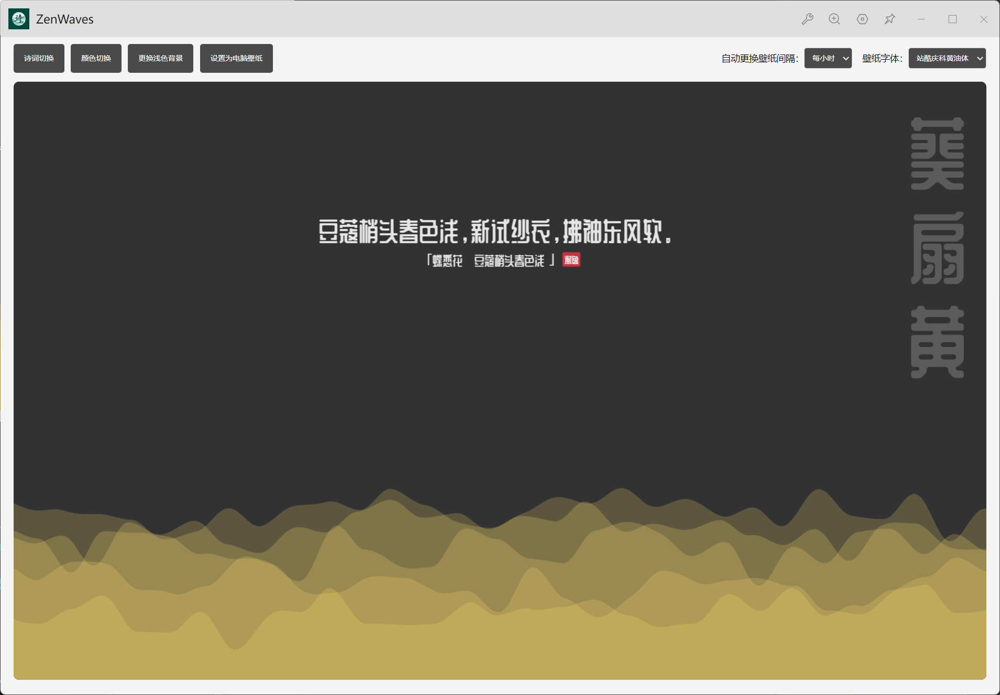
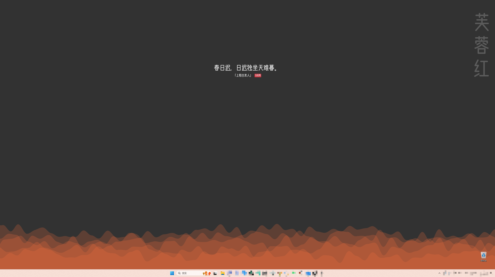

# 国风壁纸

  

## 项目介绍
国风壁纸是一款融合水波纹动效与古诗词的精美壁纸插件。它将传统文化与现代设计完美结合，为您的桌面带来独特的视觉体验和文化韵味。

## 主要特点
- 🌊 优雅的水波纹动效背景
- 📝 精选古诗词展示
- 🎨 支持明暗主题切换
- 🖼 传统雅致配色方案
- 📚 支持更换字体
- ⚡️ 一键设置壁纸
- ⏰ 支持定时更换壁纸
- 🎯 支持拖拽图片直接设置为壁纸

## 预览效果

  
  
  

## 使用方法
1. 在 uTools 中搜索「国风壁纸」插件
2. 选择喜欢的主题和配色
3. 点击「设置壁纸」即可应用

## 技术栈
- Vue 3
- Vite
- P5.js（水波纹动效）
- 今日诗词 API